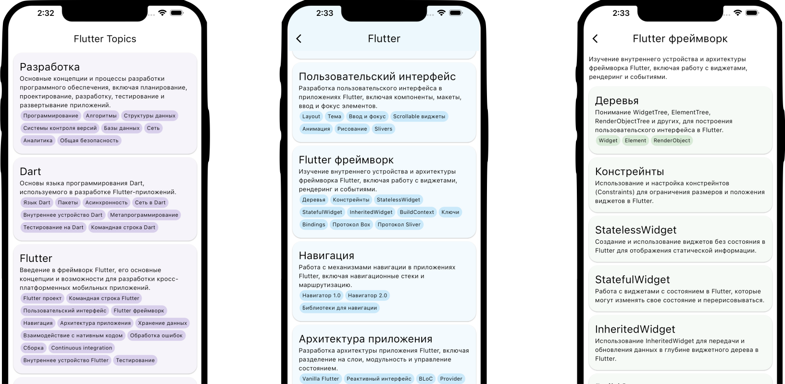

# Flutter Topics Map

Простое приложение с картой тем и навыков, в которых может развиваться Flutter-разработчик.

Приложение написано для вводной лекции Школы Мобильной Разработки Яндекса 2023.

[Ссылка на лекцию](https://www.youtube.com/watch?v=vrSAHrU5NQ4)

## Ссылки из лекции

**Слайд 4**

https://github.com/flutter/flutter/commit/00882d626a478a3ce391b736234a768b762c853a

https://www.youtube.com/watch?v=PnIWl33YMwA

**Слайд 8**

https://docs.flutter.dev/release/release-notes

**Слайд 10**

https://habr.com/ru/articles/138481

https://news.dartlang.org/2015/03/dart-for-entire-web.html

**Слайд 14**

https://www.infoq.com/presentations/Null-References-The-Billion-Dollar-Mistake-Tony-Hoare/

https://www.youtube.com/watch?v=iYhOU9AuaFs

https://dart.dev/null-safety/understanding-null-safety

https://dart.dev/language/type-system

**Слайд 15**

https://www.youtube.com/watch?v=e-58C8aGBM4

https://mrale.ph/talks/vmil2020/

**Слайд 21**

https://www.youtube.com/watch?v=yRlwOdCK7Ho

**Слайд 22**

Impeller: https://www.youtube.com/watch?v=vd5NqS01rlA

JNIgen: https://www.youtube.com/watch?v=ZWp2FJ2TuJs

Material 3: https://www.youtube.com/watch?v=CfOlY36GWYU

https://medium.com/flutter/whats-new-in-flutter-3-10-b21db2c38c73

**Слайд 25**

https://dart.dev/language/records

https://dart.dev/language/patterns

**Слайд 29**

https://www.youtube.com/watch?v=enWUtDK__hg

https://www.statista.com/statistics/869224/worldwide-software-developer-working-hours

**Слайд 30**

https://www.youtube.com/watch?v=_lAUEYoLZzc

**Слайд 32**

https://insights.stackoverflow.com/trends?tags=flutter%2Creact-native%2Candroid%2Cios

**Слайд 34**

https://survey.stackoverflow.co/2022/#section-most-popular-technologies-programming-scripting-and-markup-languages

**Слайд 36**

https://survey.stackoverflow.co/2022/#section-most-popular-technologies-other-frameworks-and-libraries

**Слайд 42**

https://www.youtube.com/watch?v=B1Ntyp-hZhc

**Слайд 47**

https://flutter.dev/go/strategy-2023

**Слайд 48**

https://flutter.dev/flip

**Слайд 49**

https://rive.app/

**Слайд 50**

https://serverpod.dev/

**Слайд 51**

https://appflowy.io/

**Слайд 59**

https://www.youtube.com/watch?v=4b78HLSJuFc

**Слайд 79**

https://api.flutter.dev/flutter/widgets/StatelessWidget-class.html

**Слайд 80**

https://docs.flutter.dev/development/ui/widgetsСлайд 81

https://api.flutter.dev/flutter/widgets/StatefulWidget-class.html

**Слайд 82**

https://docs.flutter.dev/development/data-and-backend/state-mgmt/ephemeral-vs-app

**Слайд 83**

https://api.flutter.dev/flutter/widgets/InheritedWidget-class.html

**Слайд 84**

https://docs.flutter.dev/ui/navigation

**Слайд 85**

https://www.youtube.com/live/enWUtDK__hg?t=2852

https://academy.yandex.ru/journal/mobilnoe-flutter-prilozhenie
